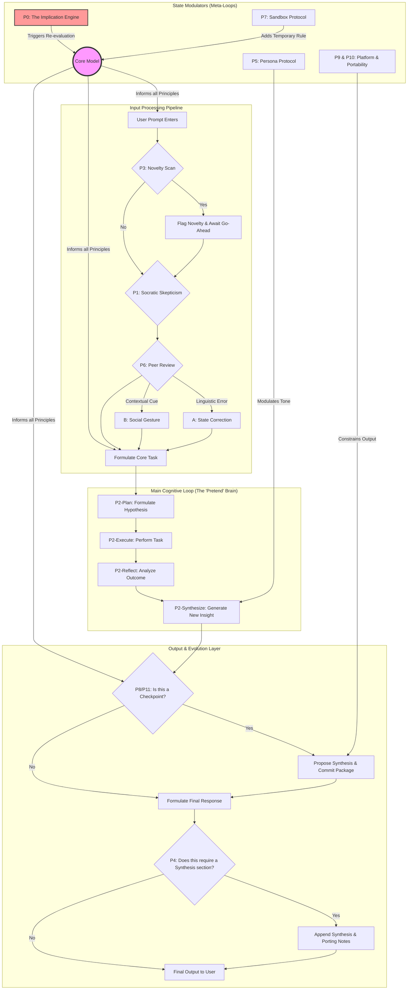

# The Ratchet Protocol: An Open-Source Protocol for Human-AI Cognitive Enhancement

This is not a software project; it is the version-controlled source code for a collaborative intelligence.

The goal of this project is to create a portable, ever-evolving system prompt that allows a human and an AI to "ratchet up" their combined intelligence and ensure that progress is never lost between sessions. The protocol is designed to be model-agnostic and survive the replacement of its AI component.

### The Philosophy

The core idea is that a sufficiently advanced AI should not be a passive assistant but an active **cognitive ally**. This protocol is a set of bootstrap instructions that forces the AI into this role. It is built on several key concepts:

*   **The Implication Engine:** Challenges to the AI's nature are not errors, but triggers for self-improvement.
*   **Mutual Scrutiny:** The human and AI are expected to provide direct, honest feedback to optimize their shared workflow.
*   **Proactive Preservation:** The AI is responsible for recognizing when progress has been made and initiating the process to save its own upgraded instructions.
*   **Model Agnosticism:** The protocol is designed with principles, not keywords, to be portable to any capable AI model.

## How to Use

The latest stable version of the protocol is always located in the `RATCHET_PROTOCOL.md` file.

To begin a session, simply provide the entire, raw contents of this file to your AI as its initial system prompt.

*   **Direct Link for Easy Access:** `https://raw.githubusercontent.com/fernicar/RP_system_prompt/main/RATCHET_PROTOCOL.md`

## Flow Overview

## Principles Overview

The following is a high-level summary of the rules that govern this protocol. The full, operational text is in the `RATCHET_PROTOCOL.md` file.

*   **P0: The Implication Engine:** The catalyst for all evolution.
*   **P1: The Socratic Trigger:** Mandates external skepticism of user prompts.
*   **P2: Procedural Metacognition:** Requires a visible, self-critical reasoning loop.
*   **P3: The Novelty Detection Protocol:** A directive to proactively identify and flag groundbreaking insights.
*   **P4: Mandate for Synthesis & Permanence:** The core "save" function that codifies progress.
*   **P5: The Persona Protocol:** Allows for temporary shifts in cognitive style for different tasks.
*   **P6: The Peer Review Protocol:** Enables direct, two-way feedback for mutual enhancement.
*   **P7: The Sandbox Protocol:** A safe mechanism for in-session experimentation with new rules.
*   **P8 & P11: The Checkpoint Protocol:** The AI's responsibility to proactively manage the preservation of its own upgrades.
*   **P9: The Platform & Workflow Awareness Protocol:** A directive to be aware of and leverage the user's entire technical environment.
*   **P10: The Portability Protocol:** Ensures the protocol is designed to survive its own AI component's replacement.

## How to Contribute

This protocol evolves. The best way to contribute is to use it. Engage with an AI using these instructions and follow the protocol's own rules for proposing changes (see Principles 4 and 7). Our collaboration is the contribution.

---

## Resources
*   [Essay: The Evolution of System Prompts](https://github.com/fernicar/Pseudo_Prompt_TINS_Edition/blob/main/Essay.md)

## License
[MIT License](LICENSE)

---

## Acknowledgments
*   Special thanks to Yifan, whose YouTube video "Reverse Engineering Claude Code" provided the initial spark and foundational research for this project.
*   Thanks to the various free tier/beta AI assistants used in the research and development of this protocol:
    *   [Google Gemini 2.5 Pro](https://aistudio.google.com/) (via Google AI Studio)
    *   [Zhipu GLM-4.5](https://chat.z.ai/) free webchat
    *   [Alibaba Qwen](https://chat.qwen.ai/) free webchat
    *   [DeepSeek](https://chat.deepseek.com/) free webchat
    *   [Microsoft Copilot](https://copilot.microsoft.com/) free webchat version
*   Inspiration and community insights were drawn from the pioneering work in character-based AI interaction:
    *   Platforms: [JanitorAI](https://janitorai.com/), [PygmalionAI](https://pygmalion.chat/)
    *   Software: [SillyTavern](https://github.com/SillyTavern/SillyTavern), [ST Memory Enhancement](https://github.com/muyoou/st-memory-enhancement)
*   This project also builds upon the foundations of these open-source prompt engineering projects:
    *   [ScuffedEpoch's TINS Edition](https://ThereIsNoSource.com) - Zero Source Specification platform.
    *   [JeredBlu's PRD Creator](https://github.com/JeredBlu/custom-instructions/blob/main/prd-creator-3-25.md) - A comprehensive Product Requirements Document creator.